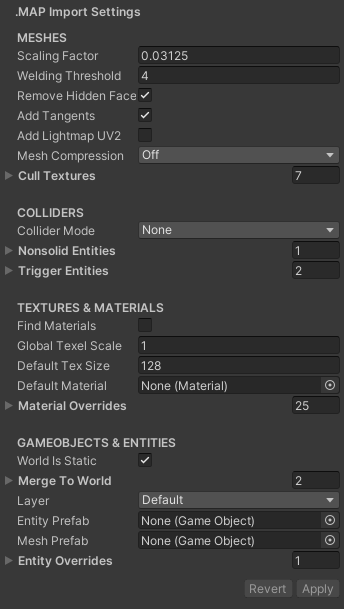

# Scopa documentation

Scopa is a Unity package that adds Quake / Half-Life 1 .MAP, .WAD, and .FGD file support to Unity for a full level design / modder workflow.

- [MAP Importer](MapImporter.md): Quake 1 .MAP (Valve format, mapversion 220)
- [WAD Importer](WadImporter.md) / [WAD Exporter](WadExporter.md): Quake 1 WAD2 and Half-Life WAD3
- .FGD export: Quake 1 TrenchBroom format with .OBJ model previews

> NOTE: This plugin and documentation assumes familiarity with Quake / Half-Life mapping concepts.

## Installation

This is a custom [Unity Package](https://docs.unity3d.com/Manual/PackagesList.html) that can be automatically installed / updated in Unity 2019.3 or later. There are zero dependencies.

1. in Unity, open the [Package Manager window](https://docs.unity3d.com/Manual/upm-ui.html)
2. click the "+" button and select "add package from Git URL" [(see Unity Manual: Installing from a Git URL)](https://docs.unity3d.com/2021.2/Documentation/Manual/upm-ui-giturl.html)
3. paste the .git URL of this repo: `https://github.com/radiatoryang/scopa.git` and click Add.

If you're using an older version of Unity, or don't want to use the Package Manager, then clone, submodule, or download+unzip this repo into your /Assets/ or /Packages/ folder. 

## Usage

Scopa works at editor-time or runtime.

### Editor-time usage

Put a .MAP or .WAD somewhere in the `/Assets/` folder, and Unity will automatically detect and import it like any other asset. 

Select the file in the Project tab and configure the import settings in the Inspector. You can mouse-over anything for more info.

> For more, see [Map Importer](MapImporter.md)

### Runtime usage

First, create an asset to configure how maps get imported at runtime:
1. in Unity, go to `Project tab > Create > Scopa > Map Config Asset` for .MAPs (or `Wad Config Asset` for .WADs)
2. This config asset is just Scriptable Object container for import settings. Select the asset and configure in the Inspector.

You can also simply create a `new ScopaMapConfig()` or `new ScopaWadConfig()` and configure it via code.

Then in your game code:
1. add `using Scopa;` at the top of the C# file
2. call `ScopaCore.ParseMap()` to read the .MAP data
3. call `ScopaCore.BuildMapIntoGameObject()` with the map data and config.

## Mapping with Scopa

Some general advice -- **treat the .MAP file as the "single source of truth."** Do all level edits in a .MAP level editor like TrenchBroom. Avoid editing the imported game object prefab instance in Unity, **because your changes might be erased when you re-import the .MAP again.**

Scopa has no map compiling nor VIS process. The difference between world brushes vs. brush entities doesn't matter.

### FGD generation

To place items, NPCs, etc. in a level editor, you need to load a .FGD entity definition file into the tool.

Quake modders still write their FGDs by hand, which is sad, so instead we provide a built-in FGD generator. The workflow looks like this:

1. in Unity, go to the Project tab and select `Create > Scopa > FGD Config Asset`.
2. select the new FGD Config Asset file and edit it in the Inspector tab: create new entity types, add properties, etc.
3. when you're ready, click the `Export FGD...` button at the top of the Inspector, and save your new .FGD file

(PLANNED) Additionally, it can also generate API docs as .MD or .HTML, to serve as documentation for level designers.

We recommend saving the .FGD file **outside of the /Assets/ folder**, because you should not set your level editor to load your entire Unity project.

## Legal / Acknowledgments / Credits

See the README.
