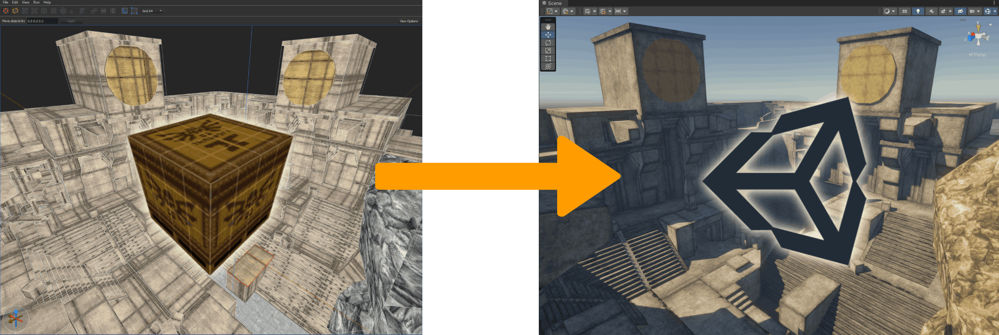

# Scopa

*Scopa* ("broom" in Latin) is a Unity level design plugin that adds supports for various Quake / Half-Life / Source file formats. Like [Qodot](https://github.com/QodotPlugin/qodot-plugin) but for Unity. To build levels, we strongly recommend [TrenchBroom](https://github.com/TrenchBroom/TrenchBroom) and the Quake 1 .MAP file format.

# WARNING: in unstable early development, not ready for public use yet, might change a lot or break

- [MAP, RMF*, VMF*, JMF* import](Documentation~/MapImporter.md) generates model prefab with meshes, colliders, entities.
    - for any file format that isn't Quake 1 .MAP, see [Limitations](#limitations)
- [WAD import](Documentation~/WadImporter.md) / [WAD export](Documentation~/WadExporter.md) (Quake 1 WAD2 / Half-Life WAD3 textures format, not Doom)
- FGD creator can export entity definitions out to TrenchBroom
- works at editor time or runtime (for modding support)

## Installation

This is a [Unity Package](https://docs.unity3d.com/Manual/PackagesList.html) for Unity 2020.1 or later. It has zero dependencies. To install, open [Package Manager](https://docs.unity3d.com/Manual/upm-ui.html) and add `https://github.com/radiatoryang/scopa.git` [(more info and help)](https://docs.unity3d.com/2021.2/Documentation/Manual/upm-ui-giturl.html) (TIP: You'll probably need to [install Git](https://git-scm.com/downloads) first.)

## Usage

Put a map file (MAP, RMF, VMF, JMF) or WAD file in your `/Assets/` folder and it'll import automatically, generating assets / prefabs for you to use as if it were any other file. Defaults are tuned to typical Quake / Half-Life [level design metrics](https://book.leveldesignbook.com/process/blockout/metrics), 32 map units = 1 Unity meter.

**Do your edits in the level editor, not in Unity!** Any in-editor changes may be erased when you re-import the .MAP again. Treat the .MAP file as the [single source of truth](https://en.wikipedia.org/wiki/Single_source_of_truth). 

To learn more, see the full [Documentation](Documentation~/Index.md).

## Limitations

**This package doesn't have game code.** It just imports and exports files. You still have to make the game yourself.

**We treat the Quake 1 Trenchbroom .MAP v220 file format as the core feature set. Anything beyond these core features (brushes and entity keyvalue pairs) is not supported.**
- Non-brush geometry (VMF displacement, Quake 2 brush face flags, etc.) is not supported.
- Source VMF entity I/O is not supported, only standard Half-Life 1 style keyvalues.
- Editor cameras, visgroups, and smoothing groups are ignored.
- Basically, if [Sledge-Formats](https://github.com/LogicAndTrick/sledge-formats) doesn't support it, then we sure don't either.

## Contributions

Issues and pull requests are currently NOT accepted at this time. Development is still very early.

## Acknowledgments / Credits

- lots of file format handling from [Sledge Formats](https://github.com/LogicAndTrick/sledge-formats)
- vertex color AO baking from [VTAO](https://github.com/Helix128/VTAO)
- GPU-based texture resizing from [Unity GPU Texture Resize](https://github.com/ababilinski/unity-gpu-texture-resize)
- color palette generation from [cSharpColourQuantization](https://github.com/bacowan/cSharpColourQuantization/blob/master/ColourQuantization/MedianCut.cs)
- looking for a BSP plugin? try [Unity3D BSP Importer](https://github.com/wfowler1/Unity3D-BSP-Importer)
